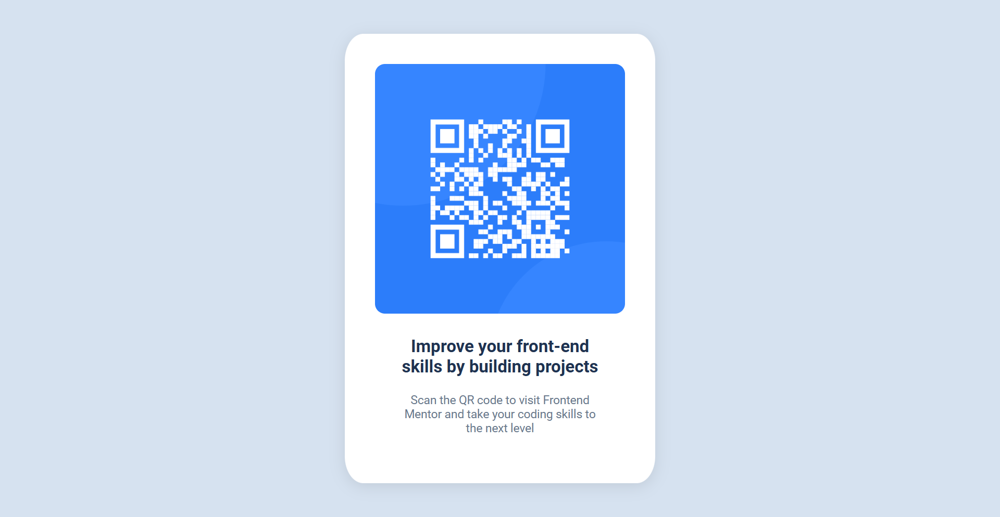

# Frontend Mentor - QR code component solution

This is a solution to the [QR code component challenge on Frontend Mentor](https://www.frontendmentor.io/challenges/qr-code-component-iux_sIO_H). Frontend Mentor challenges help you improve your coding skills by building realistic projects. 

## Table of contents

- [Overview](#overview)
  - [Screenshot](#screenshot)
  - [Links](#links)
- [My process](#my-process)
  - [Built with](#built-with)
  - [What I learned](#what-i-learned)
  - [Continued development](#continued-development)
  - [Useful resources](#useful-resources)

## Overview

This project is a QR Code component designed to improve front-end skills through hands-on practice. It includes responsive design, layout techniques, and user interaction principles.

### Screenshot

### Links

- Live Site URL: [live site](https://halder16.github.io/Frontendmentor/QR%20code%20component/)

## My process

I started by designing the QR Code component layout using Flexbox. I then implemented the QR code image and added text descriptions below it. I made sure that the layout worked well on both mobile and desktop screens by testing with various viewport sizes.

### Built with

- HTML
- CSS (Flexbox, custom properties)
- Google Fonts (Roboto, Outfit)
- [Visual Studio Code](https://code.visualstudio.com/) with the [Live Server extension](https://marketplace.visualstudio.com/items?itemName=ritwickdey.LiveServer) for real-time updates

### What I learned

I learned how to implement Flexbox for centering elements and making layouts responsive. I also experimented with Google Fonts and explored how to load fonts using the `link` element.

### Continued development

In the future, I plan to enhance the interactivity and responsiveness of the component by adding the following features:
- Implement a zoom effect on hover to make the QR code image more interactive.
- Change the text color or apply animations when hovering over the text to create a dynamic user experience.
- Make the design fully responsive across various screen sizes, ensuring optimal layout and readability on mobile devices.

### Useful resources

- [Flexbox documentation](https://css-tricks.com/snippets/css/a-guide-to-flexbox/)
- [Google Fonts](https://fonts.google.com/)
- [MDN Web Docs - CSS Box Shadow](https://developer.mozilla.org/en-US/docs/Web/CSS/box-shadow) - Helped me add subtle shadows to the container.
- [Live Server Extension](https://marketplace.visualstudio.com/items?itemName=ritwickdey.LiveServer) - Allowed me to see changes in real time without manually refreshing the browser.

## Author

- Frontend Mentor - [@Halder16](https://www.frontendmentor.io/profile/Halder16)
- LinkedIn - [@sohan-halder-84794a1b7](https://www.linkedin.com/in/sohan-halder-84794a1b7)
