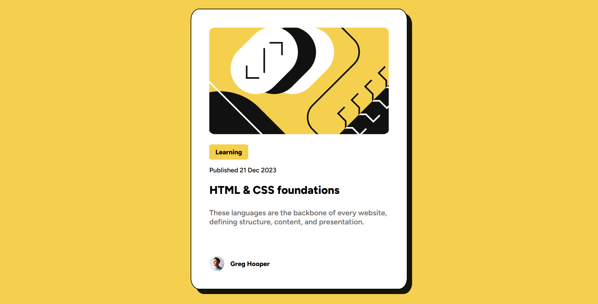

# Frontend Mentor - Blog preview card solution

This is a solution to the [Blog preview card challenge on Frontend Mentor](https://www.frontendmentor.io/challenges/blog-preview-card-ckPaj01IcS). Frontend Mentor challenges help you improve your coding skills by building realistic projects. 

## Table of contents

- [Overview](#overview)
  - [The challenge](#the-challenge)
  - [Screenshot](#screenshot)
  - [Links](#links)
- [My process](#my-process)
  - [Built with](#built-with)
  - [What I learned](#what-i-learned)
  - [Continued development](#continued-development)
  - [Useful resources](#useful-resources)
- [Author](#author)
- [Acknowledgments](#acknowledgments)

## Overview

This project is a blog preview card designed to enhance front-end development skills through practical implementation. It incorporates key concepts such as responsive design, CSS layout techniques, and attention to user experience. The component aims to create a clean, functional design with interactive elements that adapt to various screen sizes.

### The challenge

Users should be able to:

- See hover and focus states for all interactive elements on the page

### Screenshot

### Links

- Solution URL: [Add solution URL here](/)
- Live Site URL: [Add live site URL here](/)

## My process

I started by structuring the blog review card layout using Flexbox, arranging the provided images and text to match the reference design. I divided the card into sections (image, heading, description, and author info) and refined their positioning with padding and margins. Using the measurements, colors, and typography from the Figma file as a guide, I made small tweaks to closely match the design. Finally, I ensured the layout looked good on both mobile and desktop screens.

### Built with

- CSS for styling  
- Flexbox for layout  
- Visual Studio Code with Live Server extension for real-time updates
- Figma (for reference design and measurements)

### What I learned

In this project, I gained a better understanding of importing fonts locally available on my device.

### Continued development

I plan to improve my typography integration to create more cohesive and visually appealing designs. Additionally, I would like to experiment with CSS Grid as an alternative to Flexbox to explore its potential and versatility in future projects.

### Useful resources

- [MDN Web Docs](https://developer.mozilla.org/en-US/) – Comprehensive documentation for HTML, CSS, and JavaScript  
- [Flexbox Froggy](https://flexboxfroggy.com/) – Interactive Flexbox game to strengthen layout skills 
- [Stack Overflow](https://stackoverflow.com/) – Community for troubleshooting and problem-solving

## Author

- Frontend Mentor - [@Halder16](https://www.frontendmentor.io/profile/Halder16)
- LinkedIn - [@sohan-halder-84794a1b7](https://www.linkedin.com/in/sohan-halder-84794a1b7)

## Acknowledgments

I would like to thank the creators of the resources I used, including the Figma design file, which provided valuable reference for this project. I also appreciate the Flexbox and CSS documentation for their guidance.
