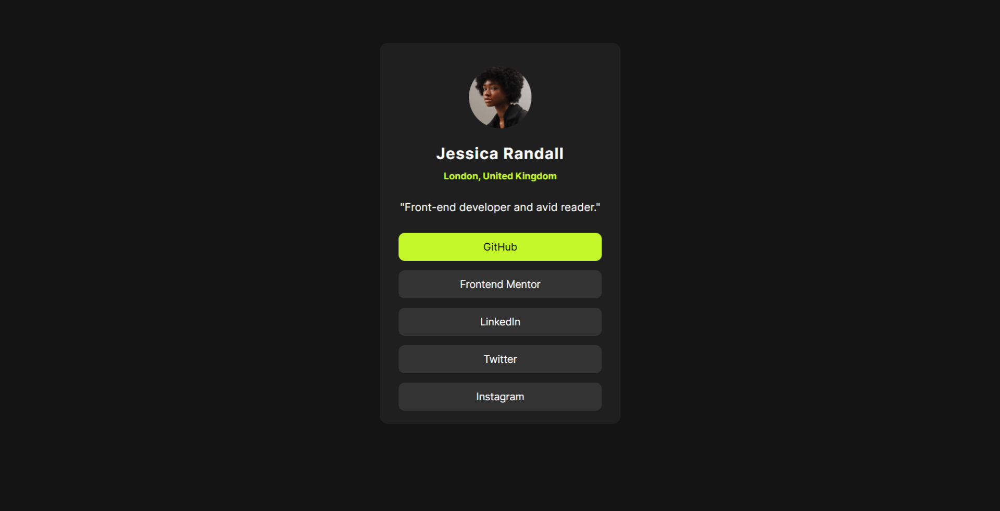

# Frontend Mentor - Social links profile solution

This is a solution to the [Social links profile challenge on Frontend Mentor](https://www.frontendmentor.io/challenges/social-links-profile-UG32l9m6dQ). Frontend Mentor challenges help you improve your coding skills by building realistic projects. 

## Table of contents

- [Overview](#overview)
  - [The challenge](#the-challenge)
  - [Screenshot](#screenshot)
  - [Links](#links)
- [My process](#my-process)
  - [Built with](#built-with)
  - [What I learned](#what-i-learned)
  - [Continued development](#continued-development)
  - [Useful resources](#useful-resources)
- [Author](#author)

## Overview

### The challenge

Users should be able to:

- See hover and focus states for all interactive elements on the page

### Screenshot

### Links

- Solution URL: [solution](...)
- Live Site URL: [live site](...)

## My process

I started by working with flexboxes to organize the content. Initially, I placed all the elements into their respective flex containers to build a foundational structure. Then, I focused on gradually refining the layout, ensuring the content aligned correctly. Once the structure was in place, I began applying colors, carefully matching them to the provided reference. Lastly, I revisited and adjusted minor details, fine-tuning the layout to enhance the overall appearance and ensure it met the design requirements.

### Built with

- CSS custom properties
- Flexbox
- Visual Studio Code with Live Server extension for real-time updates

### What I learned

While working on this card, I reinforced my understanding of flexbox for structuring layouts and gained more confidence in applying it effectively. I also practiced importing fonts locally, which improved my workflow. A new and specific learning moment for me was using the CSS `letter-spacing` property to adjust text spacing. These small but valuable experiences added to my overall skill set.

### Continued development

I plan to improve my typography integration to create more cohesive and visually appealing designs. Additionally, I would like to experiment with CSS Grid as an alternative to Flexbox to explore its potential and versatility in future projects.

### Useful resources

- [MDN Web Docs](https://developer.mozilla.org/) – Comprehensive documentation for HTML, CSS, and JavaScript  
- [Flexbox Froggy](https://flexboxfroggy.com/) – Interactive Flexbox game to strengthen layout skills  
- [Stack Overflow](https://stackoverflow.com/) – Community for troubleshooting and problem-solving

## Author

- Frontend Mentor - [@Halder16](https://www.frontendmentor.io/profile/Halder16)
- LinkedIn - [@sohan-halder-84794a1b7](https://www.linkedin.com/in/sohan-halder-84794a1b7)